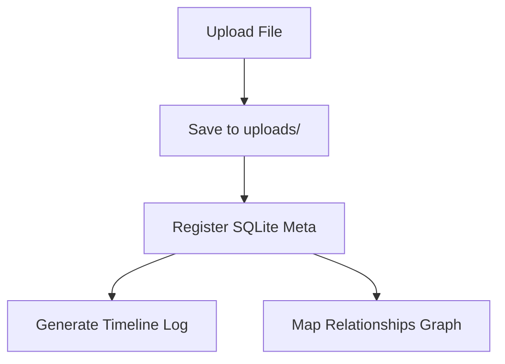

# MemoryVerse AI - Verification Guide
## System Testing & Layout Inspection Protocol

This document is formatted in Markdown and serves as a printable layout guide to test the document ingestion pipeline.

---

### 1. Verification Checklist

| Phase | Feature | Expected Outcome | Status |
| :--- | :--- | :--- | :--- |
| **01** | Authentication | Signup/Login triggers JWT storage | [ ] Pending |
| **02** | File Upload | Supports PDF, TXT, and Images | [ ] Pending |
| **03** | Document Explorer | Grid/List views, search, previews | [ ] Pending |
| **04** | Activity Timeline | Grouped under relative periods | [ ] Pending |
| **05** | Graph Canvas | React Flow renders connections | [ ] Pending |

---

### 2. Core Operational Flow

### 3. File Summary
- **Size**: 1.5 KB
- **Format**: Markdown Document (.md)
- **Author**: MemoryVerse Assistant
- **Generation Date**: 2026-06-27
